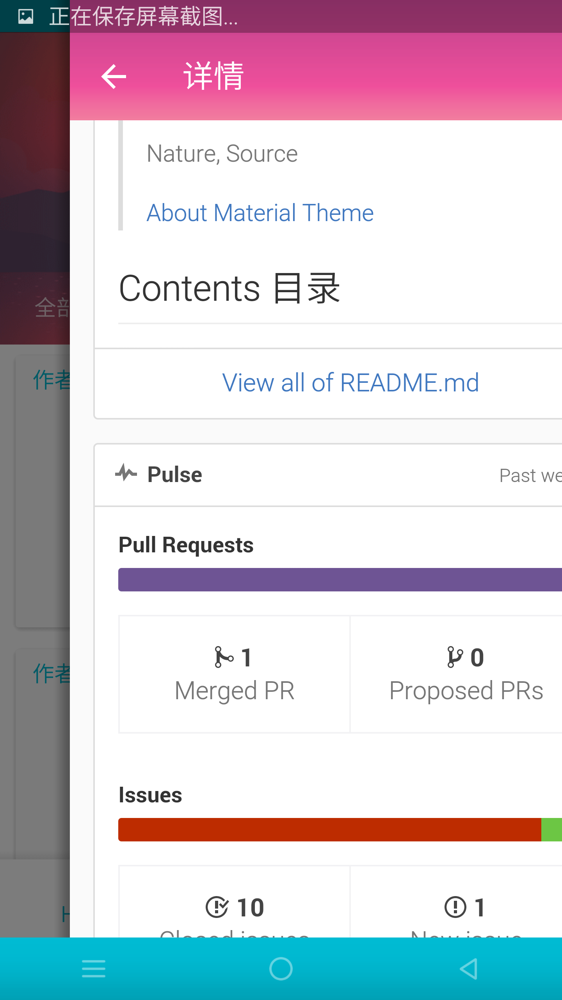
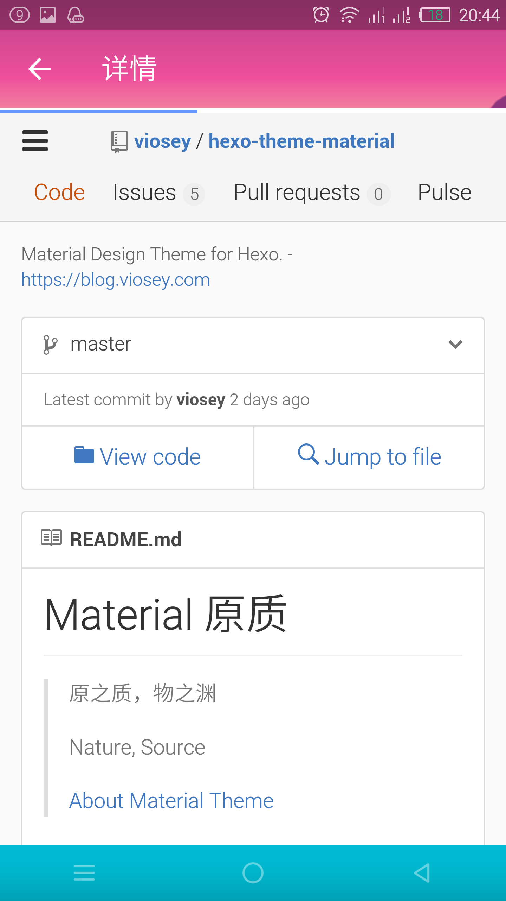
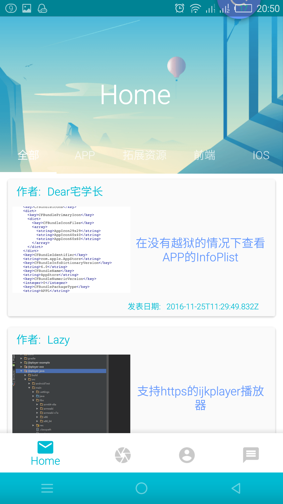
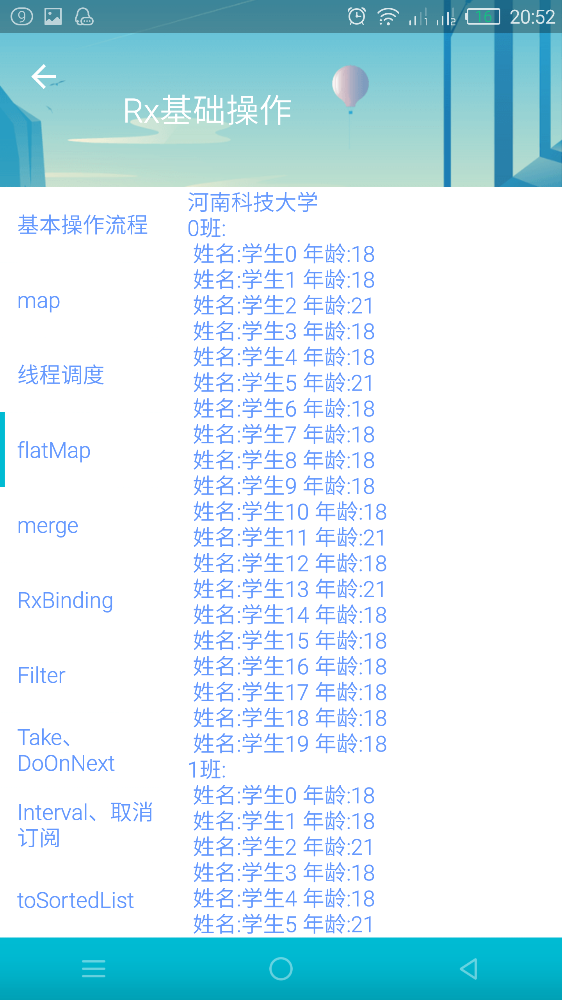
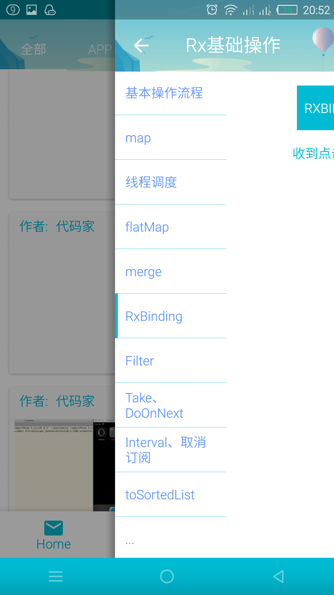

# 快速开发框架(MD风格)
##包含内容如下:
####1、根据手势关闭Activity、Fragment
####2、栈方式管理Activity、Fragment
####3、RxJava(各种操作符用法)
####4、MVP+RxJava+Retrofit(OkHttp)+Fresco
####5、底部导航栏
####6、各种工具类
####7、沉浸式状态栏
####8、ADB开启Wifi调试 
####9、图文预加载结构缩略图
####10、ViewPager+Fragment => LazyLoad 
####    不断更新中.....
## Screenshots

>联系作者： 
###### QQ:415192022
###### Email:15502113227@163.com
###### Github:https://github.com/415192022
